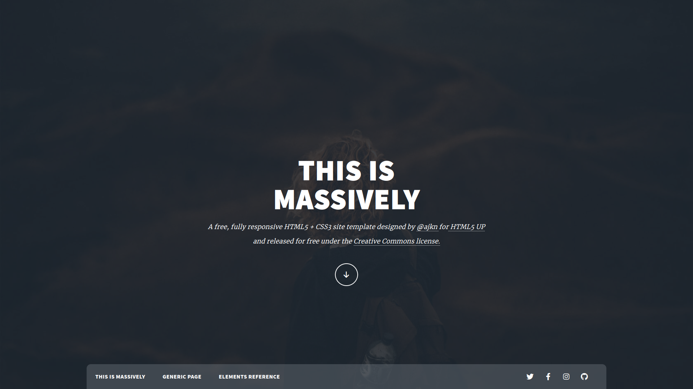
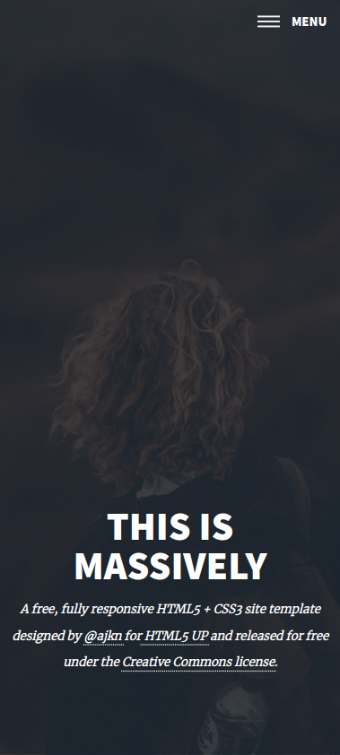
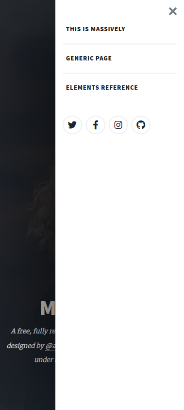

# Massively Landing Page

Uma página com design moderno e responsível construída com HTML5, CSS3 (Utilizando a metodologia BEM junto do Pré-processador SASS) e um pouco de JavaScript.

A modern and responsive page design built with HTML5, CSS3 (using the BEM methodology along with the SASS Preprocessor) and a little JavaScript.

[Clique aqui para acessar a página](https://victor-henri.github.io/layout-challenges/massively-landing-page/)

[Click here to access the page](https://victor-henri.github.io/layout-challenges/massively-landing-page/)

 - Exemplos (Examples):

    
    

        
        
    

